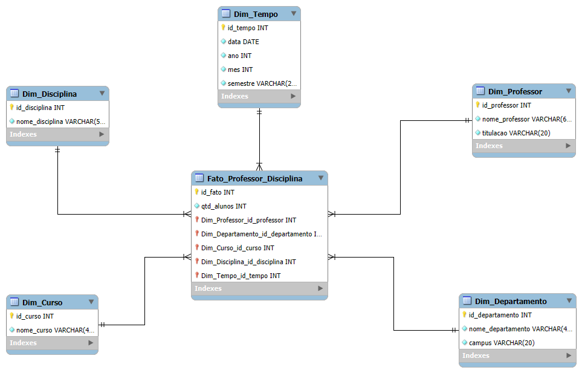

# BootCamp 🌿Suzano & DIO: Análise de Dados com Power BI 🎲 (*Desafio 07*)
### Desafio 07 - **Dashboard** de Vendas com *Power BI* Utilizando _**Star Schema**_  
    
## 🎯Objetivo:
Criar um **Diagrama Dimensional Star Schema**, pode ser no **MySQL Workbench**, conforme *Descrição do Desafio* na **Apresentação do Desafio**.  
O intuito é aplicar o conhecimento compartilhado até essa etapa do curso.  
A ferramenta a ser utilizada será: **MySQL Workbench**.  

    
## 🤓Apresentação do Desafio:
>### Descrição do Desafio
>Criar o diagram dimensional _**Star Schema**_ com base no diagrama relacional disponibilizado.  
>O documento com os detalhes para esse desafio são:  
> - [Descrição do Desafio - Criando um Star Schema para Cenários de Vendas com P.docx](./insumos/Descrição%20do%20Desafio%20-%20Criando%20um%20Star%20Schema%20para%20Cenários%20de%20Vendas%20com%20P.docx)  
>  
>Imagem do modelo relacional disponibilizado:  
> -   
  
### Objetivo:
- Criação de um *diagrama dimensional*, **Star Schema**
- O foco da análise será os dados dos professores
- O modelo deve permitir responder questões sobre o professor, cursos ministrados, departamento ao qual pertence, etc. 
- Para criação da dimensão de tempo, considere que haja datas de oferecimento de curso/disciplina ou qual preferir no modelo relacional
   
## 🤓Desafio Feito😎! Minha resolução🎉🎉🎉:  
>### 📝Check-List
>✅ 01) Entender modelo de dados relacional disponibilizado.  
>✅ 02) Identificar questões a serem respondidas com o modelo a ser criado.  
>✅ 03) Transformar os dados. Processo de limpeza e transformação.  
>✅ 04) Definição da Tabela Fato.  
>✅ 05) Definição das Tabelas Dimensão.  
  
  
> ## 📋**Entrega**:  
> 🎯Modelo dimensional **Star Schema**:  
>   
  
 ❗👏🎉Fim do Desafio 07