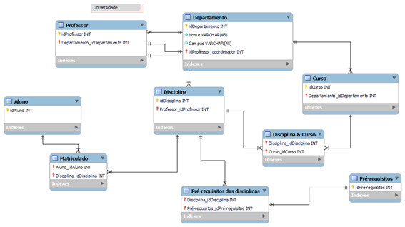

# BootCamp 🌿Suzano & DIO: Análise de Dados com Power BI 🎲 (*Desafio 07*)
### Desafio 07 - **Dashboard** de Vendas com *Power BI* Utilizando _**Star Schema**_  
    
## 🎯Objetivo:
Confeccionar um **Dashboard** em Power BI, conforme *Descrição do Desafio* na **Apresentação do Desafio**.  
O intuito é aplicar o conhecimento compartilhado até essa etapa do curso.  
A ferramenta a ser utilizada será: **Microsoft Power BI**.  

    
## 🤓Apresentação do Desafio:
>### Descrição do Desafio
>Criar o diagram dimensional _**Star Schema**_ com base no diagrama relacional disponibilizado.  
>O documento com os detalhes para esse desafio são:  
> - [Descrição do Desafio - Criando um Star Schema para Cenários de Vendas com P.docx](./insumos/Descrição%20do%20Desafio%20-%20Criando%20um%20Star%20Schema%20para%20Cenários%20de%20Vendas%20com%20P.docx)  
>  
>Imagem do modelo relacional disponibilizado:  
> -   
  
### Objetivo:
- Criação de uma instância na Azure para MySQL
- Criar o Banco de Dados com base disponível no github
- Integração do Power BI com MySQL no Azure 
- Verificar problemas na base a fim de realizar a transformação dos dados
   
## 🤓Desafio Feito😎! Minha resolução🎉🎉🎉:  
>### 📝Check-List
>✅ 01) Criar conta e logar na Microsoft Power BI.  
>✅ 02) Obter dados das Fontes.  
>✅ 03) Transformar os dados. Processo de limpeza e transformação.  
>✅ 04) Modelo de Dados - Fazer o Modelo Dimensional.  
>✅ 05) Montar os visuais desejados.  
  
  
> ## 📋**Entrega**:  
> 🎯Arquivo fonte do Power BI:  
> [Desafio_03_DIOeSuzano_PowerBI-DashboardVendasUtilizandoStarSchema.pbix](./Desafio_03_DIOeSuzano_PowerBI-DashboardVendasUtilizandoStarSchema.pbix)  
Dashboard** de Vendas com *Power BI* Utilizando _**Star Schema
 ❗👏🎉Fim do Desafio 07